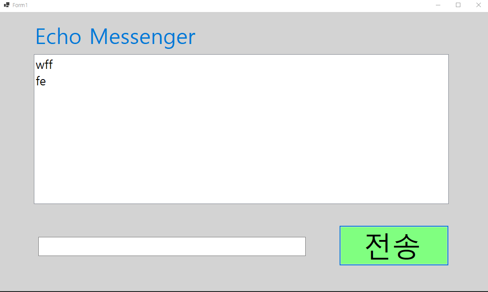
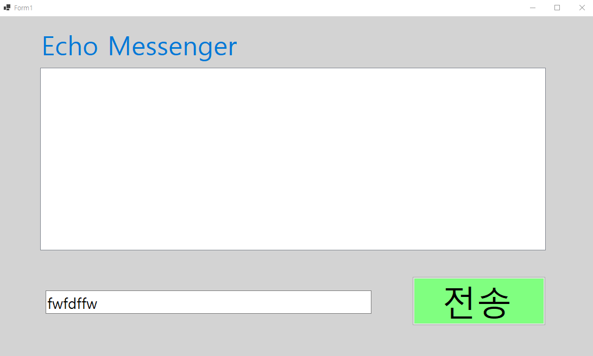
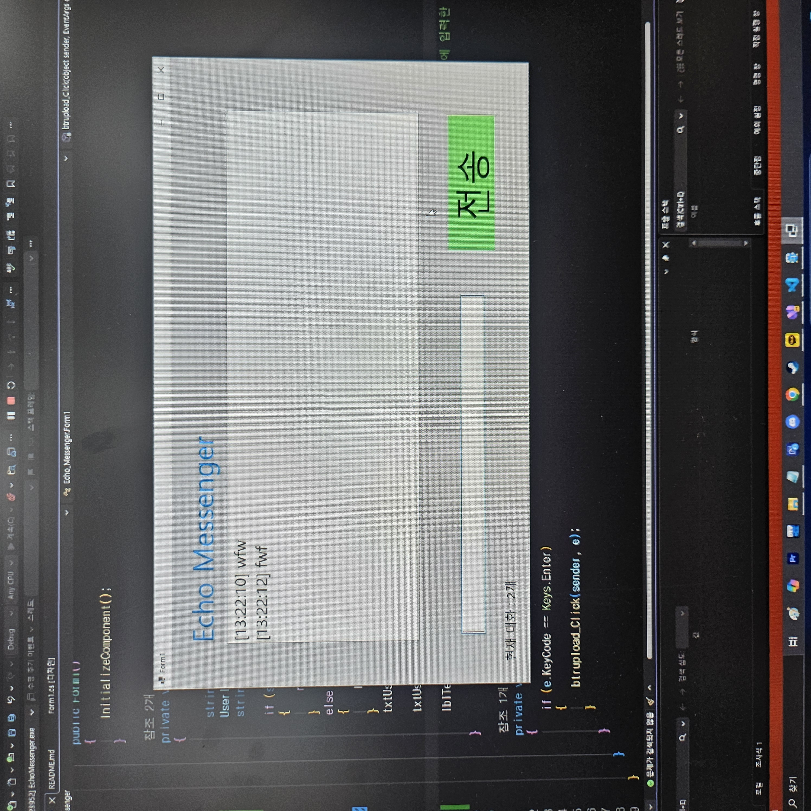
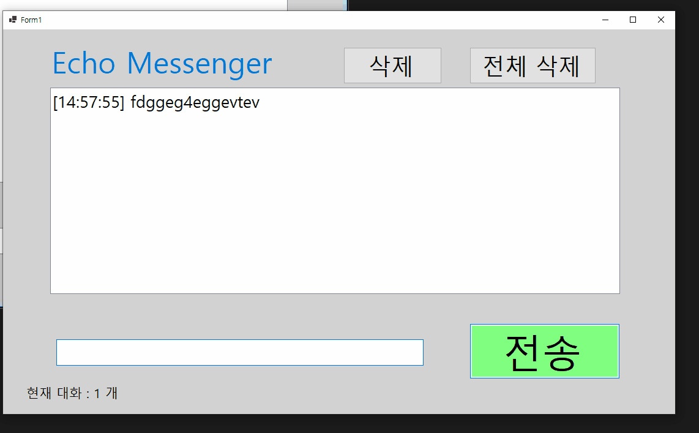
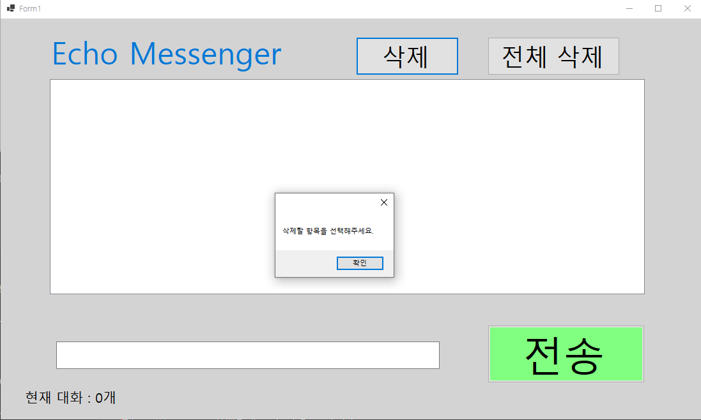
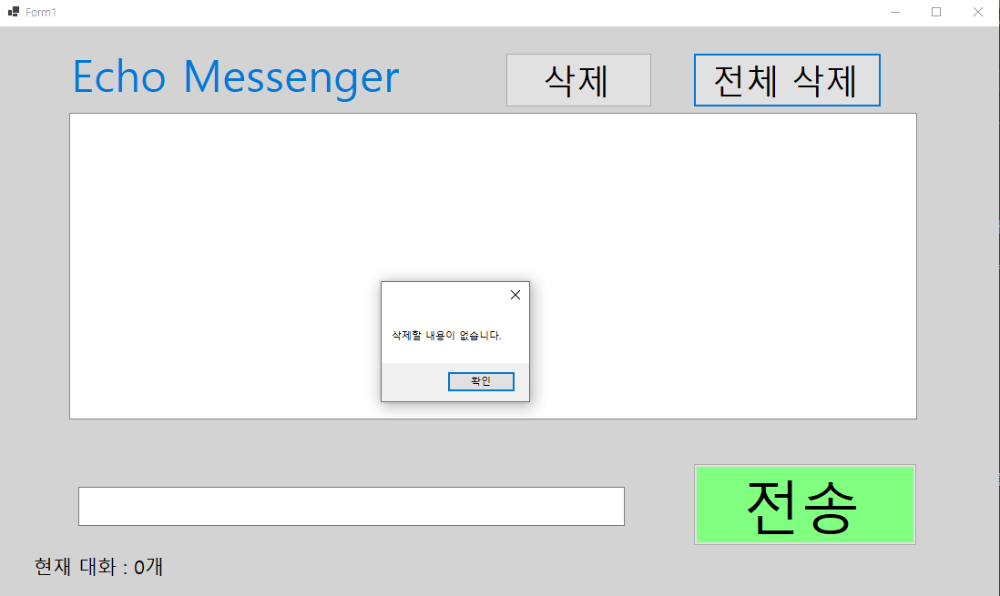
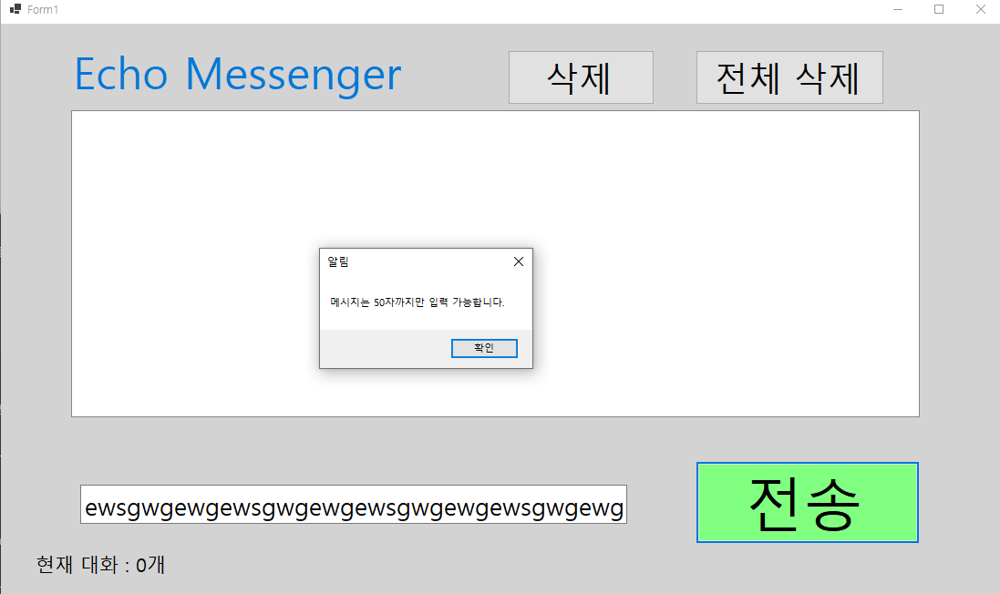

# (C# 코딩) 에코 메신저

## 개요

  - C# 프로그래밍 학습
  - 1줄 소개: 사용자의 키보드 입력을 화면에 적절히 표시하는 프로그램
  - 사용한 플랫폼:
    C#, .NET Windows Forms, Visual Studio, GitHub
  - 사용한 컨트롤:
    Label, TextBox, ListBox, Button
  - 사용한 기술과 구현한 기능:
      - Visual Studio를 이용한 UI 디자인
      - string 클래스를 이용한 사용자 입력 데이터 처리
      - ListBox 컨트롤을 이용한 메시지 표시 및 관리
      - 입력값 검증을 통한 공백 입력 방지 및 글자 수 제한
      - DateTime 클래스를 이용한 현재시간 정보 구하기
      - 라벨을 통한 메시지 카운팅 기능 구현
      - Trim을 이용한 불필요한 공백 문자열 제거
      - 선택 항목 삭제 및 전체 초기화 기능 구현
      - 50자 초과 입력 시 전송 차단 및 경고 메시지

## 실행 화면 (과제1)

  - 과제1 코드의 실행 스크린샷
  
  - 과제 내용
      - Label, TextBox, Button, ListBox를 적절히 배치합니다.
      - 전송 버튼 클릭 시 TextBox의 텍스트를 ListBox의 항목으로 추가합니다.
      - 추가 직후 TextBox의 내용을 비워 다음 입력을 준비합니다.
  - 구현 내용과 기능 설명
      - 입력창에 메시지를 입력하고 전송 버튼을 누르면 메시지가 리스트 박스에 표시됩니다.
      - 계속 반복하면 메시지가 리스트 박스에 한 줄씩 계속 추가되어 대화창 형태를 구성합니다.
      - 스크롤 바 또한 자동 생성되며 많은 메시지가 쌓여도 편리하게 탐색할 수 있습니다.

## 실행 화면 (과제2)

  - 과제2 코드의 실행 스크린샷
  
  
  - 과제 내용
      - 전송 후 Focus()를 호출하여 입력창에 입력 포커스 자동 설정
      - KeyDown 이벤트를 이용하여 엔터키(Enter)를 이용한 메시지 전송 기능
      - IsNullOrWhiteSpace을 통한 공백 입력 시 리스트 추가 방어 로직
  - 구현 내용과 기능 설명
      - 전송 후 Focus()를 호출하여 메시지 전송 후 사용자가 다시 클릭하지 않아도 입력창에 포커스가 유지되도록 구현했습니다.
      - 마우스 클릭 없이 엔터키만으로도 빠르고 편리하게 메시지를 전송할 수 있습니다.
      - IsNullOrWhiteSpace을 이용하여 내용이 없는 공백 문자열은 전송되지 않도록 예외 처리를 수행했습니다.

## 실행 화면 (과제3)

  - 과제3 코드의 실행 스크린샷
  
  - 과제 내용
      - DateTime.Now() 을 통해 메시지별 타임스탬프(현재 시간) 표시
      - 하단 라벨을 통한 실시간 메시지 개수 카운팅
      - Trim() 메서드를 활용한 문자열 앞뒤 공백 제거
  - 구현 내용과 기능 설명
      - DateTime() 클래스를 활용해 각 메시지가 입력된 정확한 시간 [HH:mm:ss] 형태로 함께 기록합니다.
      - 현재 리스트에 쌓인 메시지가 총 몇 개인지 하단 라벨에 실시간으로 업데이트합니다.
      - 문자열 앞뒤의 불필요한 공백을 제거하여 깔끔한 텍스트만 출력되도록 했습니다.

## 실행 화면 (과제4)

  - 과제4 코드의 실행 스크린샷
  
  
  
  
  - 과제 내용
      - 삭제 버튼 클릭 시 RemoveAt() 으로 선택된 항목을 삭제
      - 전체 삭제 버튼 클릭 시 Items.Clear() 로 모든 항목을 삭제
      - 메시지 글자 수 50자 이상 입력 시 전송 방지 및 MessageBox() 로 경고창 표시
  - 구현 내용과 기능 설명
      - 삭제 버튼으로 특정 메시지를 선택해 삭제하거나, 전체 삭제 버튼으로 리스트를 한 번에 비울 수 있습니다.
      - 삭제 시 선택된 항목이 없는 경우 경고 창을 띄워 사용자에게 알립니다.
      - 50자가 넘는 긴 문장은 전송되지 않으며 사용자에게 경고메세지를 띄우도록 하였습니다.

## 배운 내용

  - 이전 주차보다 더 많은 내용을 배우고 또 구현해야해서 힘들었지만, 그만큼 유익했다.
  - 유효하지 않은 입력에 대한 예외 처리를 구현하는 방법을 배웠다.
  - 코드에 오류나 버그가 발생했을 때, 블로그나 생성형 인공지능의 도움을 통해 해결였다.